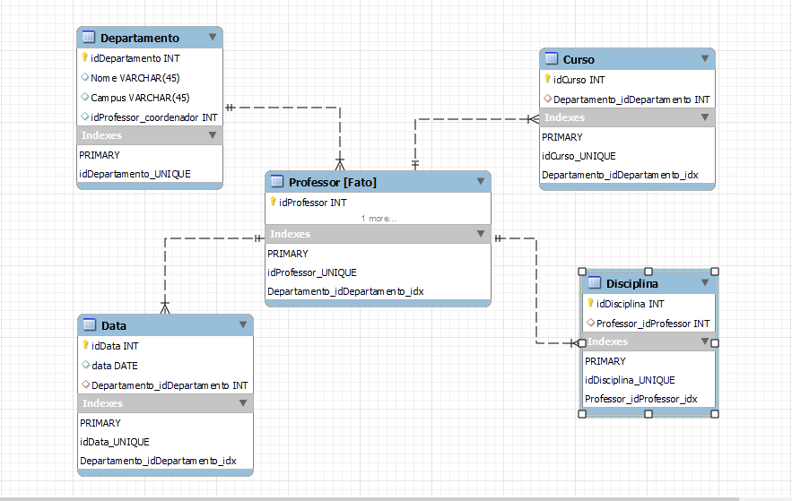

# Projeto de Elaboração de um Star Schema
Laboratório de projeto da plataforma Dio para o Bootcamp "Data Analytics com Power BI": o exercício é criar um star schema usando um conjunto de tabelas dadas.

## Modelo do Star Schema
